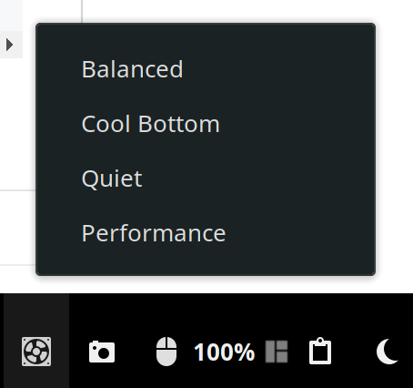

# smbios-thermal-ctl-gnome-ext
I use this for setting the smbios thermal mode on my Dell XPS13 2-in-1 7390.



## FAQ 
### Is therea way to set smbios mode without having to enter the admin password?
Currently this is impossible. Thermal calls aren't whitelisted in the linux kernel. Check https://github.com/dell/libsmbios/issues/68 for further informations.

## Installation

### From source code

Clone the git repo

```console
git clone https://github.com/SebastianLuebke/smbios-thermal-ctl-gnome-ext.git ~/.local/share/gnome-shell/extensions/smbiosthermalctl@luebke.io
```

reload gnome by pressing alt + F2 and enter r

### extensions.gnome.org

https://extensions.gnome.org/extension/3276/smbios-thermal-ctl/

## Support
Feel free to submit a pull request or consider making a donation on [Flatter](https://flattr.com/@SebastianNoelLuebke).
